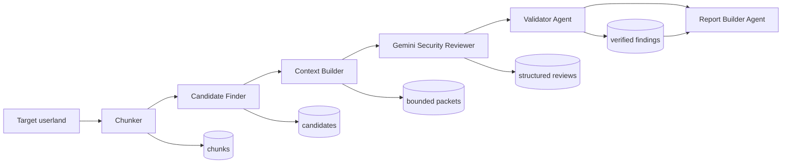

# AI 기반 SAST 설계 및 분석 보고서

BoB 15기 보안컨설팅 트랙 박소은

## 1. 요약

- 대상: [https://github.com/raspberrypi/userland.git](https://github.com/raspberrypi/userland.git)
- 고정 커밋: `a54a0dbb2b8dcf9bafdddfc9a9374fb51d97e976`
- 환경: Windows PowerShell, Python
- 기준선 C/C++ 관련 파일: 654개
- 위험 API 출현 후보: 832개
- 작성한 도구 저장소: https://github.com/soeun-727/ai-sast-userland.git
- LLM 검토 패킷: 16개
- 원시 finding: 9건
- 최종 판정: confirmed 7건, likely 2건, false positive 0건
- 심각도: high 7건, medium 2건
- Gemini 실제 사용량: 입력 54,995, 출력 5,203, 합계 69,567토큰

위험 API 검색 결과는 취약점 수가 아니라 탐색 후보 수이다. 최종 finding은
LLM 판정 후 실제 소스 파일과 줄 범위를 다시 대조해 분류하였다.

## 2. Agent 구성도



| Agent             | 역할                                 | 주요 설정/skill                           | AI 사용 | 주요 산출물                |
| ----------------- | ------------------------------------ | ----------------------------------------- | ------- | -------------------------- |
| Chunker           | 함수 단위 분할, 원본 줄 보존         | Tree-sitter C/C++ AST                     | 없음    | `results/chunks`           |
| Candidate Finder  | 위험 API와 우선순위 기반 후보 축소   | API 가중치, High ≥ 8, Medium ≥ 4          | 없음    | `results/candidates`       |
| Context Builder   | 직접 호출 관계와 제한된 문맥 구성    | 4,000 추정 토큰, 관련 함수 3개, 깊이 1    | 없음    | `results/context`          |
| Security Reviewer | 보안 추론과 JSON Schema 판정         | Gemini 3.6 Flash, low thinking, prompt v1 | Gemini  | `results/security-reviews` |
| Validator         | 소스 대조, 판정 보정, 중복 제거      | 3단계 판정, excerpt SHA-256, fail-closed  | 없음    | `results/validation`       |
| Report Builder    | manifest와 검증 결과를 보고서로 결합 | 결정론적 템플릿, API 호출 없음            | 없음    | `docs/final-report.md`     |

## 3. Agent skill 작성 시 주안점

이 설계에서 skill은 각 Agent가 지켜야 하는 역할·입력·출력·판정 규칙으로
정의했다. 상세 구현은 코드와 설정으로 버전 관리하며 다음 원칙을 적용했다.

1. **단일 책임**: 후보 검색, 문맥 구성, 추론, 검증, 보고를 분리해 한 Agent가
   지나치게 많은 판단을 하지 않도록 했다.
2. **입출력 계약**: JSON/JSONL과 JSON Schema를 사용해 다음 Agent가 자유 형식
   문장을 다시 해석하지 않도록 했다.
3. **근거 우선**: 위험 API만으로 취약점을 확정하지 않고 파일·함수·줄·공격
   전제조건을 요구했다.
4. **불확실성 표현**: `no_finding`, `findings`, `insufficient_context` 및
   `confirmed`, `likely`, `false_positive`를 구분했다.
5. **재현성과 추적성**: 커밋, packet ID, prompt version, 모델, 토큰, 응답 ID,
   소스 excerpt 해시를 기록했다.
6. **실패 안전성**: 누락된 검증 판정은 자동 승인하지 않고 오류로 처리하고,
   API 결과는 패킷마다 체크포인트한다.
7. **프롬프트 절제**: 역할, 금지사항, 필요한 출력 필드만 명시하고 저장소 전체나
   이미 결정론적으로 계산 가능한 통계를 프롬프트에 넣지 않았다.

Security Reviewer의 실제 system prompt는
[`prompts/security-reviewer-system.md`](../prompts/security-reviewer-system.md),
상세 Agent별 설계 근거는 `docs/*-analysis.md`에 보존한다.

## 4. 토큰 절약 설계와 도입 이유

| 설계                          | 도입 이유                                               | 효과                                        |
| ----------------------------- | ------------------------------------------------------- | ------------------------------------------- |
| 함수 단위 AST 분할            | 대형 파일 전체 전송 방지                                | 파일 경계 대신 의미 단위 유지               |
| 위험 API 결정론적 사전 필터   | LLM이 단순 문자열 검색에 토큰을 쓰지 않게 함            | 35,887 → 15,984 추정 토큰, 55.46% 감소      |
| High/Medium만 검토            | 낮은 위험 후보의 선별 비용 억제                         | 최종 검토 대상을 16개 패킷으로 제한         |
| 직접 호출 1단계 문맥          | 함수 하나만 볼 때의 오판을 줄이되 호출 그래프 폭증 방지 | 코드 문맥 19,878 추정 토큰, 패킷 최대 2,762 |
| 패킷당 4,000 추정 토큰 상한   | 거대 프롬프트와 비용·지연 방지                          | 모든 패킷 예산 이내                         |
| 구조화 출력                   | 장문의 설명과 재파싱 재시도 방지                        | 짧고 기계 검증 가능한 결과                  |
| 로컬 Validator/Report Builder | 확정적 작업에 유료 추론을 사용하지 않음                 | 추가 API 토큰 0                             |
| 성공 결과 재개·캐시           | 429 또는 중단 시 완료 요청 재전송 방지                  | 무료 할당량 보존                            |

관련 함수만 추가한 이유는 토큰 절감만을 극대화하면 보안 판정 문맥이 사라지기
때문이다. 따라서 후보 축소 후 직접 호출 함수 최대 3개를 다시 붙이는 절충안을
선택했다. 실제 Gemini 입력 토큰이 추정 코드 토큰보다 큰 것은 system prompt,
메타데이터, JSON Schema가 함께 전송되기 때문이다.

## 5. 분석 결과

| 판정      | 심각도 | CWE     | 함수                                       | 위치                                                     | 제목                                                                                                |
| --------- | ------ | ------- | ------------------------------------------ | -------------------------------------------------------- | --------------------------------------------------------------------------------------------------- |
| confirmed | high   | CWE-121 | `dtoverlay_override_one_target`            | `helpers/dtoverlay/dtoverlay.c:1512`                     | Stack-based Buffer Overflow in string override parsing                                              |
| confirmed | high   | CWE-120 | `dtoverlay_foreach_override_target`        | `helpers/dtoverlay/dtoverlay.c:1859`                     | Stack Buffer Overflow via `strcpy` on `target_value`                                                |
| confirmed | high   | CWE-120 | `dtoverlay_foreach_override_target`        | `helpers/dtoverlay/dtoverlay.c:1888`                     | Stack Buffer Overflow via `memcpy` on `prop_name`                                                   |
| confirmed | high   | CWE-120 | `dtoverlay_extract_override`               | `helpers/dtoverlay/dtoverlay.c:2101`                     | Buffer Overflow in `dtoverlay_extract_override` via unbounded `strcpy`                              |
| confirmed | high   | CWE-190 | `AccessVideoCoreMemory`                    | `host_applications/linux/libs/debug_sym/debug_sym.c:656` | Integer Overflow in Memory Bounds Check and Size Calculation leading to Out-of-Bounds Memory Access |
| confirmed | medium | CWE-476 | `dtoverlay_dup_property`                   | `helpers/dtoverlay/dtoverlay.c:2320`                     | Unchecked malloc return value leads to NULL pointer dereference                                     |
| confirmed | medium | CWE-404 | `OpenVideoCoreMemoryFileWithOffsetAndSize` | `host_applications/linux/libs/debug_sym/debug_sym.c:439` | Resource Leak / Memory Leak on Error Path in OpenVideoCoreMemoryFileWithOffsetAndSize               |
| likely    | high   | CWE-190 | `dynstring_patch`                          | `helpers/dtoverlay/dtoverlay.c:290`                      | Integer Overflow Leading to Heap Buffer Overflow in dynstring_set_size Sizing Suffix Calculation    |
| likely    | high   | CWE-120 | `dtoverlay_init_map`                       | `helpers/dtoverlay/dtoverlay.c:2610`                     | Stack-based Buffer Overflow via Unbounded sprintf                                                   |

## 6. Finding별 검증 내용

### 1. Buffer Overflow in `dtoverlay_extract_override` via unbounded `strcpy`

- 판정: `confirmed` (검증 신뢰도 0.98)
- 심각도/CWE: `high` / `CWE-120`
- 위치: `helpers/dtoverlay/dtoverlay.c:2101-2101`
- 공격 표면: A crafted device-tree override literal can exceed the caller's fixed 256-byte destination.
- 검증 근거: The function receives value_size but line 2101 uses strcpy without consulting it. The literal is only checked for NUL termination, not destination capacity.
- 개선안: Replace `strcpy(override_value, literal_value)` with a bounded copy such as `snprintf(override_value, value_size, "%s", literal_value)` or perform explicit bounds checking against `value_size` before copying.

### 2. Resource Leak / Memory Leak on Error Path in OpenVideoCoreMemoryFileWithOffsetAndSize

- 판정: `confirmed` (검증 신뢰도 0.9)
- 심각도/CWE: `medium` / `CWE-404`
- 위치: `host_applications/linux/libs/debug_sym/debug_sym.c:439-491`
- 공격 표면: Malformed or unreadable VideoCore symbol data can select an error path after allocations.
- 검증 근거: The error path closes memFd and frees newHandle, but does not free newHandle->symbol or labels already allocated with vcos_strdup. The model's evidence was incomplete, but the leak exists.
- 개선안: Before freeing `newHandle` at `err_exit`, check if `newHandle->symbol` is non-NULL, iterate through allocated `sym->label` strings up to the processed count, free them, and free `newHandle->symbol`.

### 3. Integer Overflow in Memory Bounds Check and Size Calculation leading to Out-of-Bounds Memory Access

- 판정: `confirmed` (검증 신뢰도 0.94)
- 심각도/CWE: `high` / `CWE-190`
- 위치: `host_applications/linux/libs/debug_sym/debug_sym.c:656-709`
- 공격 표면: A large address/length pair supplied to the memory-access API can wrap unsigned arithmetic.
- 검증 근거: Both the end-address check and mmap size calculation add attacker-influenced numeric values without overflow-safe subtraction checks.
- 개선안: Validate `numBytes` and perform overflow-safe arithmetic checks (e.g. ensure `numBytes <= vcHandle->vcMemEnd - vcMemAddr + 1` and check for overflows before calculating `mapSize`).

### 4. Stack-based Buffer Overflow in string override parsing

- 판정: `confirmed` (검증 신뢰도 0.99)
- 심각도/CWE: `high` / `CWE-121`
- 위치: `helpers/dtoverlay/dtoverlay.c:1512-1566`
- 공격 표면: An override string longer than 255 decoded bytes writes beyond a stack buffer.
- 검증 근거: The decode loop and final terminator increment q without checking it against the 256-byte unescaped_value array.
- 개선안: Check the buffer boundary before appending characters to `unescaped_value`. Ensure `(q - unescaped_value) < (sizeof(unescaped_value) - 1)` inside the processing loop, or dynamically allocate a buffer large enough to accommodate the unescaped output.

### 5. Stack Buffer Overflow via `strcpy` on `target_value`

- 판정: `confirmed` (검증 신뢰도 0.97)
- 심각도/CWE: `high` / `CWE-120`
- 위치: `helpers/dtoverlay/dtoverlay.c:1859-1859`
- 공격 표면: An oversized override value reaches a static 256-byte destination.
- 검증 근거: Line 1859 performs an unbounded strcpy into target_value. No local length check precedes the copy.
- 개선안: Use `snprintf` or `strncpy` with proper bound checks and ensure null-termination, e.g., `snprintf(target_value, sizeof(target_value), "%s", override_value);`.

### 6. Stack Buffer Overflow via `memcpy` on `prop_name`

- 판정: `confirmed` (검증 신뢰도 0.96)
- 심각도/CWE: `high` / `CWE-120`
- 위치: `helpers/dtoverlay/dtoverlay.c:1888-1889`
- 공격 표면: A crafted override property name can produce name_len greater than 255.
- 검증 근거: name_len controls memcpy and the subsequent terminator into prop_name[256] without a capacity check.
- 개선안: Check `name_len` against `sizeof(prop_name) - 1` before performing `memcpy`, and return an error if `name_len` exceeds the buffer capacity.

### 7. Stack-based Buffer Overflow via Unbounded sprintf

- 판정: `likely` (검증 신뢰도 0.82)
- 심각도/CWE: `high` / `CWE-120`
- 위치: `helpers/dtoverlay/dtoverlay.c:2610-2611`
- 공격 표면: A caller-controlled overlay directory longer than DTOVERLAY_MAX_PATH minus the suffix can overflow map_file.
- 검증 근거: sprintf is unbounded and strlen is used only to select a slash. Exploitability depends on whether every external caller constrains overlay_dir.
- 개선안: Replace `sprintf` with `snprintf(map_file, sizeof(map_file), ...)` and check the returned length to ensure truncation did not occur before opening the file.

### 8. Integer Overflow Leading to Heap Buffer Overflow in dynstring_set_size Sizing Suffix Calculation

- 판정: `likely` (검증 신뢰도 0.78)
- 심각도/CWE: `high` / `CWE-190`
- 위치: `helpers/dtoverlay/dtoverlay.c:290-295`
- 공격 표면: A very large requested dynamic-string size can overflow signed int growth arithmetic.
- 검증 근거: size \* 5 can overflow before realloc. Practical reachability depends on upstream DTB and process-size constraints.
- 개선안: Check for integer overflow prior to multiplying `size * 5` in `dynstring_set_size`, or use standard safe arithmetic functions / size checking before allocation.

### 9. Unchecked malloc return value leads to NULL pointer dereference

- 판정: `confirmed` (검증 신뢰도 0.99)
- 심각도/CWE: `medium` / `CWE-476`
- 위치: `helpers/dtoverlay/dtoverlay.c:2320-2321`
- 공격 표면: Memory exhaustion after fdt_setprop_inplace fails causes a process crash.
- 검증 근거: malloc(prop_len) is immediately passed to memcpy without a NULL check. This is a reliable availability flaw under allocation failure.
- 개선안: Check whether prop_data is NULL after calling malloc. If malloc fails, return an appropriate error code (e.g., -FDT_ERR_NOSPACE) before attempting to copy or call fdt_setprop.

## 7. 기존 SAST와의 비교

`Cppcheck 2.21.0`를 동일 커밋에 실행했다. 전체 저장소
분석은 60.648초 동안 1,637개 경고를 생성했으며,
이 중 error/warning 등급은 459개였다. 이 등급을
모두 취약점으로 간주하지 않는다. AI와 동일한
3개 파일 분석은 1.212초 동안 총 84개,
error/warning 등급 7개를 생성했다.

| 비교 항목                                       |  결과 |
| ----------------------------------------------- | ----: |
| AI 검증 finding                                 |     9 |
| 공통 탐지                                       |     1 |
| AI만 탐지                                       |     8 |
| 동일 범위 Cppcheck error/warning 중 AI와 불일치 |     6 |
| 동일 범위 Cppcheck 전체 경고                    |    84 |
| 전체 저장소 Cppcheck 전체 경고                  | 1,637 |

공통 탐지는 `dtoverlay_dup_property`의 할당 실패 후 NULL 역참조(CWE-476)이다.
AI만 탐지한 8건에는 경계 없는 문자열 복사, 산술 오버플로, 오류 경로 자원 누수가
포함됐다. 반대로 Cppcheck는 포맷 문자열 타입 불일치 등 AI의 제한된 16개 보안
패킷에서 finding으로 채택되지 않은 경고를 생성했다. 이 비교는 같은 파일에서
Cppcheck 주 위치가 AI 범위 안 또는 보고된 sink의 ±3줄일 때 후보를 만든 뒤 의미를
수동 확인했다.

Cppcheck는 약 61초에 전체 저장소를 결정론적으로 훑어 반복 실행에 유리하고,
AI SAST는 훨씬 좁은 후보 집합을 대상으로 공격 조건과 주변 문맥을 설명하는 데
강점이 있다. 총 경고 수와 검증 취약점 수는 의미가 다르므로 직접적인 정확도
백분율로 해석하지 않는다.

## 8. 재현 방법

```powershell
# 함수 단위 분할
.\.venv\Scripts\python.exe .\scripts\chunk_batches.py `
  --repo ..\userland --output .\results\chunks

# 위험 후보 선별
.\.venv\Scripts\python.exe .\scripts\find_candidates.py `
  --chunks .\results\chunks --config .\config\risky-apis.json `
  --output .\results\candidates

# 제한된 호출 문맥 구성
.\.venv\Scripts\python.exe .\scripts\build_context.py `
  --candidates .\results\candidates --config .\config\context-builder.json `
  --repo ..\userland --output .\results\context

# Gemini 검토
$env:GEMINI_API_KEY = "<key>"
.\.venv\Scripts\python.exe .\scripts\review_security.py `
  --context .\results\context --config .\config\security-reviewer.json `
  --prompt .\prompts\security-reviewer-system.md `
  --output .\results\security-reviews --execute

# 소스 검증
.\.venv\Scripts\python.exe .\scripts\validate_findings.py `
  --reviews .\results\security-reviews\reviews.jsonl `
  --decisions .\config\validator-decisions.json `
  --repo ..\userland --output .\results\validation

# Cppcheck 동일 범위와 전체 범위 실행
.\.venv\Scripts\python.exe .\scripts\run_cppcheck.py `
  --cppcheck .\tools\cppcheck\PFiles\Cppcheck\cppcheck.exe `
  --repo ..\userland --output .\results\cppcheck --scope matched
.\.venv\Scripts\python.exe .\scripts\run_cppcheck.py `
  --cppcheck .\tools\cppcheck\PFiles\Cppcheck\cppcheck.exe `
  --repo ..\userland --output .\results\cppcheck --scope full

# 최종 보고서 재생성
.\.venv\Scripts\python.exe .\scripts\build_report.py `
  --project . --output .\docs\final-report.md
```

API 키는 저장소에 기록하지 않으며 실행 후 환경변수에서 제거한다.

## 9. 한계 및 남은 작업

- 전체 654개 파일을 LLM으로 전수 분석한 결과가 아니라 세 배치의 우선 후보를
  분석한 결과이다.
- 함수 포인터, 매크로, 파일 간 호출과 깊은 데이터 흐름은 제한적으로 처리한다.
- `likely` 2건은 전체 호출자와 외부 입력 제약을 추가 확인해야 한다.
- 전체 Cppcheck 결과에는 빌드 구성 없이 발생한 파싱/전처리 오류가 포함될 수 있다.

## 10. 상세 산출물

- 기준선: [`baseline-analysis.md`](baseline-analysis.md)
- 후보 선별: [`candidate-analysis.md`](candidate-analysis.md)
- 문맥 구성: [`context-builder-analysis.md`](context-builder-analysis.md)
- Gemini 검토: [`security-reviewer-analysis.md`](security-reviewer-analysis.md)
- 소스 검증: [`validator-analysis.md`](validator-analysis.md)
- Cppcheck 비교: [`cppcheck-comparison.md`](cppcheck-comparison.md)
- 작성한 프롬프트: [`security-reviewer-system.md`](../prompts/security-reviewer-system.md)
